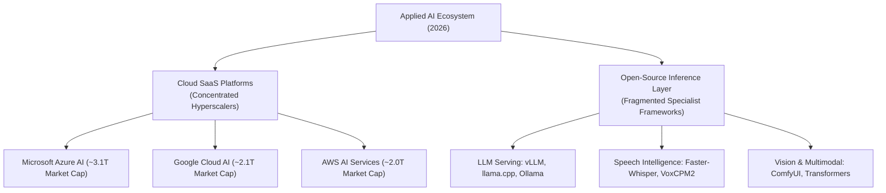

  

 

# 🚀 Awesome Applied AI APIs & Open-Source Inference Frameworks

**Curated Catalog of Commercial SaaS AI API Platforms & Self-Hosted Open-Source Serving Frameworks**

*Focused on Pre-Trained AI APIs, Multimodal LLM Inference, Speech Synthesis, Vision & High-Throughput Serving*

**Last updated: October 2026** 📅

---

## 🎯 Overview & SEO Metadata

This repository provides a comprehensive index of commercial **applied AI API services**, cloud-hosted ML microservices, and **open-source inference engines**. Whether you are deploying high-concurrency LLMs using **vLLM**, integrating real-time speech-to-text via **Deepgram** or **Faster-Whisper**, generating studio audio using **Kokoro-82M**, or scaling vision APIs through hyperscalers, this curated guide offers benchmarks, specific pricing details, free tier limits, and market analysis.

### 🔑 Key Search Topics & Keywords
`Applied AI APIs` • `LLM Serving` • `Speech Recognition` • `Text-to-Speech` • `Computer Vision APIs` • `vLLM` • `Ollama` • `Hugging Face Inference` • `Pre-Trained Machine Learning Models` • `Self-Hosted AI Infrastructure`

---

## 📋 Table of Contents

- [🌐 SaaS / Hosted AI API Platforms](#-saas--hosted-ai-api-platforms)
- [⚡ Open-Source GitHub Repositories](#-open-source-github-repositories)
  - [🦙 LLM Serving & Local Inference Frameworks](#-llm-serving--local-inference-frameworks)
  - [🗣️ Speech Recognition (ASR) & Voice Synthesis (TTS)](#%EF%B8%8F-speech-recognition-asr--voice-synthesis-tts)
  - [🖼️ Computer Vision, Image & Video Processing](#%EF%B8%8F-computer-vision-image--video-processing)
  - [🤖 AI Applications & Orchestration Interfaces](#-ai-applications--orchestration-interfaces)
- [📊 Market Analysis & Sector Fragmentation](#-market-analysis--sector-fragmentation)
- [🤝 How to Contribute](#-how-to-contribute)
- [💖 Support & Sponsor](#-support--sponsor)
- [⭐ Star History](#-star-history)
- [⚠️ Disclaimer](#%EF%B8%8F-disclaimer)

---

## 🌐 SaaS / Hosted AI API Platforms

### 📈 Market Size & Industry Structure Overview
> 💡 **Market Overview**: The global **Applied AI API & Cloud Inference Market** is valued at **$45.8 Billion in 2026** and projected to expand to **$182.4 Billion by 2030 (31.5% CAGR)**. The sector demonstrates **high concentration at the foundational platform layer** (dominated by top hyperscalers Microsoft Azure, Google Cloud, and AWS holding >65% market share), while exhibiting **moderate fragmentation in specialized verticals** such as developer-focused model hosting (Replicate, Hugging Face), speech intelligence (Deepgram, AssemblyAI), and niche computer vision.

Below is the structured breakdown of top commercial SaaS AI API platforms, sorted by **Company Valuation / Market Capitalization (Descending)**:

| 🏢 SaaS Platform | 🛠️ Primary Capabilities | 💰 Valuation / Size | 🏷️ Specific Starting Pricing | 🎁 Free Tier Limit |
| :--- | :--- | :--- | :--- | :--- |
| **[Microsoft Cognitive Services](https://azure.microsoft.com/en-us/products/cognitive-services/)** | Vision AI, Speech Services, Translator, Azure OpenAI | **~$3.1 Trillion** *(Market Cap)* | **$0.001** / 1k chars (Translator) **$0.001** / image (Vision) **$0.006** / min (Speech-to-Text) | **$200 free credit** for 30 days + **Free F0 Tier** (5k free vision calls/mo, 5 free audio hrs/mo) |
| **[Google Cloud AI APIs](https://cloud.google.com/products/ai)** | Vision AI, Video Intelligence, Speech-to-Text, Vertex AI | **~$2.1 Trillion** *(Market Cap)* | **$1.50** / 1k images (Vision API) **$0.006** / 15 sec (Video AI) **$0.006** / min (Speech) | **$300 free credits** for 90 days + **Monthly Free Tier** (1k free Vision units/mo, 60 mins Speech/mo) |
| **[AWS AI Services](https://aws.amazon.com/machine-learning/ai-services/)** | Rekognition, Transcribe, Polly, Comprehend, Bedrock | **~$2.0 Trillion** *(Market Cap)* | **$0.001** / image (Rekognition) **$0.024** / min (Transcribe) **$0.0001** / 100 chars (Comprehend) | **AWS Free Tier**: 5,000 images/mo for Rekognition (12 mos), 60 mins/mo for Transcribe (12 mos) |
| **[IBM Watson APIs](https://www.ibm.com/watson)** | Watson Assistant, Watson Discovery, NLU, Speech to Text | **~$210 Billion** *(Market Cap)* | **$0.0025** / min (Speech to Text) **$0.003** / 10,000 chars (NLU) | **IBM Cloud Lite Plan**: Free forever ($0/mo), 500 free mins/mo for Speech to Text, 30k NLU items/mo |
| **[Hugging Face Inference API](https://huggingface.co/inference-api)** | Serverless Model APIs, PRO Endpoints, Open-Source Hub | **~$4.5 Billion** *(Valuation)* | **$0.000002** / token (Serverless) PRO tier at **$9.00** / month | **Free Serverless Tier**: 30,000 free requests/month across popular open-source models |
| **[Clarifai](https://www.clarifai.com/)** | Computer Vision, Multimodal Search, Custom Model APIs | **~$1.0 Billion** *(Valuation)* | **$0.0012** / input operation **$1.20** / 1,000 model predictions | **Free Community Plan**: 1,000 free operations/month + 5,000 free model predictions/month |
| **[Replicate](https://replicate.com/)** | Cloud API for open-source AI models (Llama, SDXL, Flux) | **~$350 Million** *(Valuation)* | **$0.000225** / sec ($0.000000225/ms) on Nvidia T4 GPU **$0.000575** / sec on A100 | **$1.00 free credit** upon registration (~4,440 T4 GPU execution seconds) |
| **[AssemblyAI](https://www.assemblyai.com/)** | Speech-to-Text, Audio Intelligence, Speaker Diarization | **~$300 Million** *(Valuation)* | **$0.00025** / sec (**$0.015** / min) for Core Transcription API | **$50 free credit** on registration (~3,333 free minutes of speech transcription) |
| **[Deepgram](https://deepgram.com/)** | Speech Recognition API, Real-Time Transcription | **~$250 Million** *(Valuation)* | **$0.0043** / min (Nova-2 Batch) **$0.0059** / min (Nova-2 Streaming) | **$200 free credit** valid for 1 year (~46,000 free transcription minutes) |
| **[Rev AI](https://www.rev.ai/)** | Automated & Human-in-the-loop Speech Transcription API | **~$150 Million** *(Valuation)* | **$0.02** / minute (**$0.00033** / sec) Async Speech-to-Text | **5 free hours** of automated audio transcription upon account sign-up |

---

## ⚡ Open-Source GitHub Repositories

The open-source AI ecosystem provides production-grade models and inference backends. All repositories are sorted by **GitHub Stars_Count (Descending)**:

### 🦙 LLM Serving & Local Inference Frameworks

- **[ollama/ollama](https://github.com/ollama/ollama)** 
  - **The simplest tool to get up and running with LLMs locally.** MIT licensed, Go backend. Bundles GGUF quantization, single-binary distribution, OpenAI-compatible API, and active model registry (DeepSeek, Llama, Kimi).

- **[ggerganov/llama.cpp](https://github.com/ggerganov/llama.cpp)** 
  - **High-performance C/C++ LLM inference engine.** MIT licensed. Powers edge hardware, CPU/GPU hybrid offloading, Metal/CUDA acceleration, GGML/GGUF quantization formats.

- **[vllm-project/vllm](https://github.com/vllm-project/vllm)** 
  - **The leading high-throughput open-source LLM serving engine.** Apache-2.0 licensed. Features **PagedAttention**, continuous batching, multi-LoRA serving, multi-GPU tensor parallelism. Delivers 30-40% higher throughput under high concurrency.

- **[lm-sys/FastChat](https://github.com/lm-sys/FastChat)** 
  - **An open platform for training, serving, and evaluating LLM chatbots.** Apache-2.0 licensed. Powers LMSYS Chatbot Arena with multi-model distributed serving.

- **[sgl-project/sglang](https://github.com/sgl-project/sglang)** 
  - **Fast execution engine for LLMs and vision-language models.** Apache-2.0 licensed. High-performance RadixAttention KV cache reuse, structured output decoding, deep optimization for complex multi-turn workflows.

- **[huggingface/text-generation-inference](https://github.com/huggingface/text-generation-inference)** 
  - **Hugging Face's enterprise LLM serving toolkit.** Apache-2.0 licensed. Features Rust scheduling, OpenTelemetry tracing, bitsandbytes quantization, SSE token streaming.

---

### 🗣️ Speech Recognition (ASR) & Voice Synthesis (TTS)

- **[ggerganov/whisper.cpp](https://github.com/ggerganov/whisper.cpp)** 
  - **High-performance C/C++ port of OpenAI Whisper.** MIT licensed. Light footprint, cross-platform execution on iOS, Android, macOS Metal, Linux, and Windows edge devices.

- **[RVC-Boss/GPT-SoVITS](https://github.com/RVC-Boss/GPT-SoVITS)** 
  - **Powerful zero-shot & few-shot TTS voice cloning framework.** MIT licensed. Requires only 5 seconds of audio reference for cross-lingual voice synthesis and emotion transfer.

- **[coqui-ai/TTS](https://github.com/coqui-ai/TTS)** 
  - **Deep learning toolkit for Text-to-Speech synthesis.** MPL-2.0 licensed. Includes XTTS-v2 for multi-speaker voice cloning in 16+ languages (community-maintained fork).

- **[OpenBMB/VoxCPM](https://github.com/OpenBMB/VoxCPM)** 
  - **Multilingual TTS & Voice Design engine.** Apache-2.0 licensed. Supports 30 languages + 9 Chinese dialects, prompt-driven voice design, 48kHz output, low 1.68% WER.

- **[SYSTRAN/faster-whisper](https://github.com/SYSTRAN/faster-whisper)** 
  - **Production-standard speech recognition with CTranslate2 engine.** MIT licensed. Re-implemented OpenAI Whisper with up to 4x speedup, 8-bit quantization, 3.12% WER.

- **[m-bain/whisperX](https://github.com/m-bain/whisperX)** 
  - **Whisper speech recognition with word-level alignment & speaker diarization.** MIT licensed. Features PyAnnote speaker identification for complex multi-speaker audio.

---

### 🖼️ Computer Vision, Image & Video Processing

- **[huggingface/transformers](https://github.com/huggingface/transformers)** 
  - **State-of-the-art Machine Learning library for PyTorch, TensorFlow, and JAX.** Apache-2.0 licensed. Unified API for vision models (ViT, DETR, SAM), LLMs, and audio pipeline execution.

- **[AUTOMATIC1111/stable-diffusion-webui](https://github.com/AUTOMATIC1111/stable-diffusion-webui)** 
  - **Modular browser interface for Stable Diffusion models.** AGPL-3.0 licensed. Advanced image generation, upscaling, inpainting, ControlNet, and custom REST API endpoints.

- **[comfyanonymous/ComfyUI](https://github.com/comfyanonymous/ComfyUI)** 
  - **Modular node-based GUI & backend engine for Stable Diffusion & Flux.** GPL-3.0 licensed. Asynchronous execution graph, custom API pipelines, low VRAM optimization.

- **[Anishrkhadka/restore-lab](https://github.com/Anishrkhadka/restore-lab)** 
  - **GPU-accelerated restoration workbench for images and video.** Spatial 4x upscaling with Real-ESRGAN, GFPGAN face enhancement, NVENC encoding pipeline.

- **[Motasaith/ai-image-restorer](https://github.com/Motasaith/ai-image-restorer)** 
  - **Production-grade AI image restoration engine.** Real-ESRGAN super resolution, GFPGAN face restoration, async queue microservices, dual-port REST API & dashboard.

---

### 🤖 AI Applications & Orchestration Interfaces

- **[open-webui/open-webui](https://github.com/open-webui/open-webui)** 
  - **User-friendly AI web interface for local & cloud models.** MIT licensed. Built-in RAG document parsing, RBAC user permissions, OpenAI API compatibility, offline operation.

---

## 📊 Market Analysis & Sector Fragmentation

> 📌 **Key Takeaway**: Organizations seeking maximum enterprise reliability and managed SLAs favor **Hyperscaler SaaS APIs**. Conversely, engineering teams requiring **data sovereignty, zero latency overhead, or cost efficiency at scale** choose self-hosted engines like **vLLM** (high concurrency), **llama.cpp** (edge deployment), and **Faster-Whisper** (speech transcription).

---

## 🤝 How to Contribute

Contributions are welcome! Please follow these simple steps:

1. **Fork** the repository on GitHub.
2. Edit `README.md` to add new SaaS platforms or open-source inference repositories.
3. Ensure entries include clear description, links, specific pricing, and valid open-source Stars_Badges.
4. Submit a **Pull Request** with a brief summary of additions.

For more awesome open-source curations, check out [Awesome-Awesome-Awesome](https://github.com/ishandutta2007/Awesome-Awesome-Awesome)! ⭐

---

## 💖 Support & Sponsor

If you find this curated list of Applied AI APIs & open-source serving frameworks helpful, please consider supporting the project:

- ⭐ **Star** this repository on GitHub
- 🔀 **Fork** and share with your team or community
- ☕ **Buy me a coffee / Sponsor**: Show your appreciation on the [GitHub Sponsor Dashboard](https://github.com/sponsors/ishandutta2007)

Thank you for supporting open-source software and applied AI research! 🙌

---

## ⭐ Star History

---

## ⚠️ Disclaimer

- This is a community-curated directory intended for educational and architectural reference.
- Product features, cloud pricing tiers, and API rates change frequently; verify current pricing on official platform vendor sites.
- Review security compliance and data privacy standards (GDPR, HIPAA) prior to sending sensitive audio or text to third-party hosted APIs.

---

  <b>Made with ❤️ for AI Engineers, ML Ops Teams & Application Developers</b>

